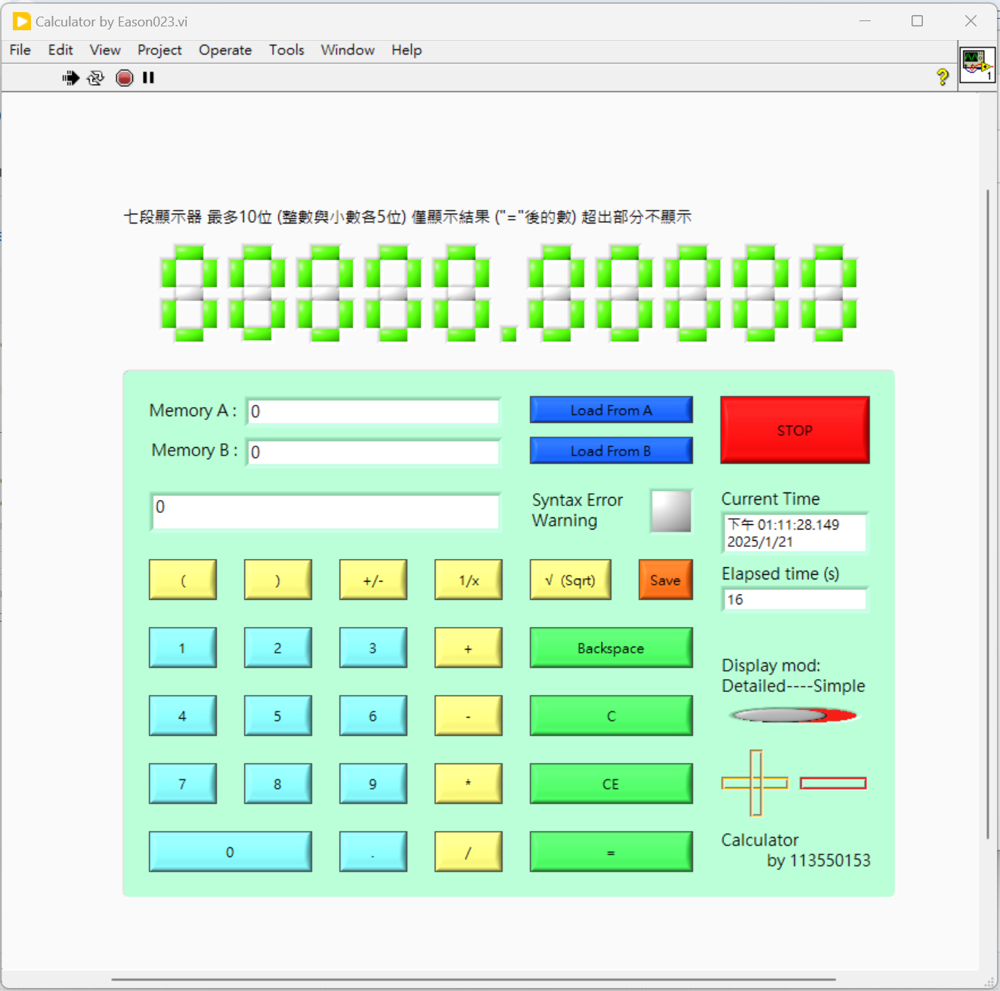

LabVIEW Calculator
---
> My first LabVIEW work.
> 
> - A simple calculator built by LabVIEW.
> - Syntax error notification function.
> - Formular computation based on built-in parse formular node.
> - Little issues:
>   - Occasional lags may happen because most things stuck in main thread.
>   - May encounter few edge cases.
> 
> With two type of GUI setup:
> 
> Standard mode:
> 
> 
>
> Lite mode:
>
> 
> 
