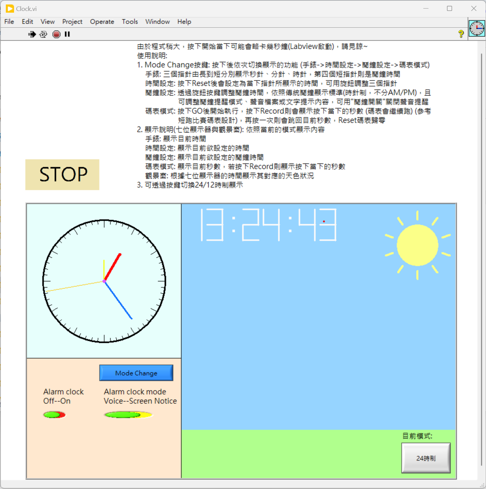
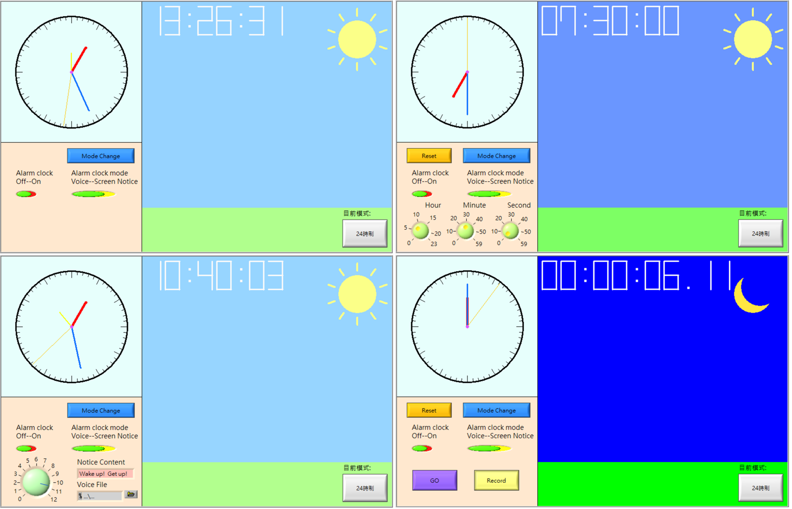

LabVIEW Clock
---
> **Note: The program may terminate if it tries to access a missing or blank music file. Please replace the file with a valid one.**
> 
> A clock with 4 control mode.
> 
> - A simple clock built by LabVIEW.
> - Everything was built in main thread.
> - Based on system time
> - Little issues:
>   - Lags may happen for program initialization.
>   - May encounter few edge cases.
> 
> Here is the control instructions:
> 
>   - Mode Change Button: Press the button to switch modes sequentially (Watch -> Time Setting -> Alarm Setting -> Stopwatch Mode).
>     - Clock: The three hands from longest to shortest represent the second hand, minute hand, and hour hand, respectively. The fourth shorter hand indicates the alarm time.
>     - Time Setting: After pressing "Reset," the hands will be set to the current displayed time. You can use the knob to adjust the three hands.
>     - Alarm Setting: Adjust the alarm time using the knob button. The display follows the traditional alarm clock standard (hour hand format, no AM/PM distinction).
>       Additionally, you can modify the alarm mode, sound file, or text reminder. Use the "Alarm Switch" to turn off the sound reminder.
>     - Stopwatch Mode: Press "GO" to start. Press "Record" to display the time (in seconds) when the button was pressed (the stopwatch continues running). Press "Record" again to return to the current time. Use "Reset" to reset the stopwatch to zero.
> 
>   - Display Instructions (7-segment display and viewfinder): Displays content based on the current mode. 
>     - Clock: Displays the current time.
>     - Time Setting: Displays the time you wish to set.
>     - Alarm Setting: Displays the alarm time you wish to set.
>     - Stopwatch Mode: Displays the current time in seconds. If "Record" is pressed, it displays the recorded time.
>     - Viewfinder: Displays the corresponding daylight conditions based on the time shown on the 7-segment display.
>     - Switch between 24-hour and 12-hour display: Use the button to toggle the time format.
> 
GUI:
> 
> 
> 
4 Clock modes:
>
> 
> 
